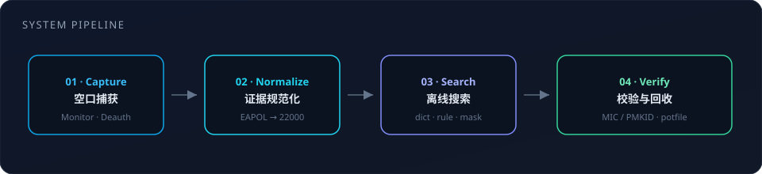
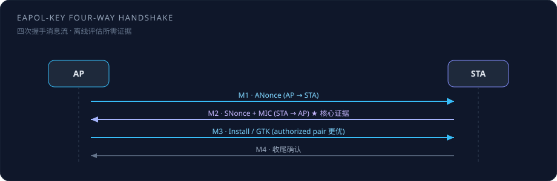
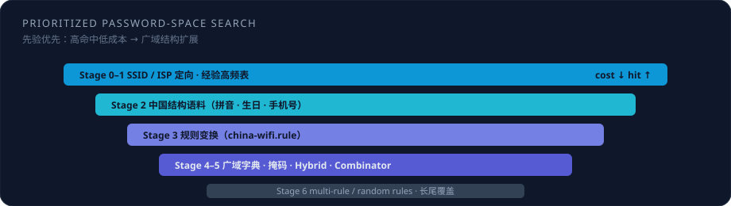
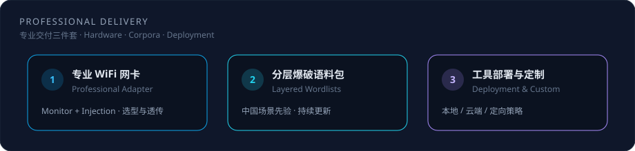

# WiFi Security Toolkit

<p align="center">
  
</p>

<p align="center">
  <strong>面向授权渗透测试与无线安全研究的 WPA/WPA2 全流程工具链</strong><br/>
  <em>An end-to-end WPA/WPA2 assessment toolkit for authorized wireless security research</em>
</p>

<p align="center">
  <a href="#方法论与系统架构-methodology"></a>
  <a href="#算力侧离线分析-offline-analysis"></a>
  <a href="#空口侧捕获链路-air-interface"></a>
  <a href="#运行环境"></a>
  <a href="#专业服务与资源获取"></a>
</p>

<p align="center">
  <a href="#中文概述">中文</a> ·
  <a href="#english-overview">English</a> ·
  <a href="#方法论与系统架构-methodology">方法论</a> ·
  <a href="#专业服务与资源获取">服务与交付</a> ·
  <a href="#免责声明-disclaimer">免责声明</a>
</p>

---

## 中文概述

本仓库提供一套**可复现**的无线局域网（WLAN）安全评估流水线，覆盖：

1. **空口观测与主动诱发**：Monitor Mode、管理帧诱导重连、EAPOL 四次握手捕获；  
2. **证据规范化**：将捕获数据导出为 hashcat 可处理的 `22000` 哈希表述；  
3. **离线口令空间搜索**：在中国用户常见口令分布先验下，组织字典、规则、掩码与混合攻击；  
4. **多算力后端**：本地 GPU（Apple Metal）、云端 CUDA（如 AutoDL）、以及 Kaggle 免费 GPU。

> **研究边界说明**  
> 公开仓库交付的是**方法、脚本骨架、规则与掩码模板**。完整分层口令语料、经过实测验证的监听网卡方案，以及一对一部署支持，因体量、更新频率与合规约束**不以全量形式托管于 GitHub**。需要完整研究资源者，请见 [专业服务与资源获取](#专业服务与资源获取)。

---

## English Overview

This repository implements a **reproducible pipeline** for authorized WPA/WPA2-PSK security assessment:

| Stage | Objective | Module |
|-------|-----------|--------|
| Air interface | Channel monitoring, controlled deauthentication, EAPOL capture | `wifi-crack-kali/` |
| Evidence export | Normalize handshakes / PMKID into hashcat `22000` | `hcx` tools + scripts |
| Offline analysis | Prioritized password-space search under CN usage patterns | `wifi-crack-notebook/` |
| Compute backends | Metal / CUDA / Kaggle GPU | local & cloud scripts |

Open-source artifacts emphasize **methodology and orchestration**. Large-scale commercial wordlists and hardware recommendations are distributed out-of-band (see Services).

---

## 方法论与系统架构 (Methodology)

<p align="center">
  
</p>

### 威胁模型与评估目标

在 **WPA2-PSK** 模型下，口令 \(P\) 经 PBKDF2-HMAC-SHA1（以 SSID 为 salt，迭代 4096）导出成对主密钥（PMK）。终端与接入点通过 **EAPOL-Key 四次握手**协商临时密钥（PTK）。  

评估方在**已获授权**前提下，不依赖在线登录尝试，而是：

\[
\text{candidate } P' \xrightarrow{\text{PBKDF2}} \text{PMK}' \xrightarrow{\text{verify MIC / PMKID}} \text{accept / reject}
\]

即：将问题转化为**离线、可并行的密钥材料校验**。

### 空口侧捕获链路 (Air Interface)

<p align="center">
  
</p>

| 环节 | 技术要点 |
|------|----------|
| **Monitor Mode** | 使网卡向用户态交付完整 802.11 管理/控制/数据帧；Managed 模式无法稳定获取握手。 |
| **信道对齐** | 捕获接口必须锁定目标 AP 工作信道，否则有效帧率接近于零。 |
| **重连诱发** | Deauthentication / Disassociation 促使已关联站点重新认证，从而产生新的 EAPOL 交换。 |
| **时序策略** | 采用「短时高密度注入 → 静默监听」循环，提高 M1–M2 同轮次配对概率。 |
| **实现选择** | 部分 USB 芯片在虚拟化透传场景下对 `aireplay-ng` 注入路径不友好；本仓库以 **Scapy 原始 802.11 帧构造**作为兼容路径（见 `auto_attack.py`）。 |

**EAPOL 消息语义（摘要）**

| 消息 | 方向 | 关键信息 | 评估价值 |
|------|------|----------|----------|
| M1 | AP → STA | ANonce | 握手轮次锚定 |
| M2 | STA → AP | SNonce + MIC | 构成可校验证据（需与有效 M1 对齐） |
| M3 | AP → STA | 安装密钥指示 | 提升 message-pair 质量（authorized） |
| M4 | STA → AP | 收尾 | 完整性辅助 |

本仓库脚本对 M1→M2 施加**时间窗与轮次一致性约束**，以降低错位 nonce 导致的伪阳性证据。

### 算力侧离线分析 (Offline Analysis)

<p align="center">
  
</p>

hashcat **mode 22000** 统一处理 PMKID（`WPA*01*`）与 EAPOL message pair（`WPA*02*`）。搜索策略遵循**先验优先**原则——先消耗高命中、低成本空间，再扩展至广域字典与结构掩码：

| 次序 | 策略 | 形式化含义 |
|:----:|------|------------|
| 0 | SSID / 运营商定向 | 条件分布 \(P(\text{pwd}\mid \text{SSID},\text{ISP})\) 的启发式采样 |
| 1 | 经验高频表 | 公开泄露与 WPA 长度约束下的高频样本 |
| 2 | 中国结构语料 | 拼音姓名、生日、手机号段等区域性模式 |
| 3 | 规则变换 | 词表 \(\times\) 变换算子（leet、年份、前后缀） |
| 4 | 广域字典 | 全局高频与大规模语料 |
| 5 | 掩码 / Hybrid / Combinator | 结构穷举与左右拼接 |
| 6 | 多规则 / 随机规则 | 覆盖未知变换的长尾 |

候选长度强制约束于 WPA 规范区间 **[8, 63]**，脚本层对字典与 hybrid 路径做预过滤，以降低无效 GPU 周期。

### 中国场景口令先验（摘要）

经验研究与公开样本表明，大量民用 PSK **偏离均匀随机**，而呈现可建模结构，例如：连续数字与键盘轨迹、手机号与生日、姓名拼音拼接、品牌/运营商默认习惯，以及有限的特殊字符后缀（如 `.`、`@`）。  
因此「中国优化」并非口号，而是把**区域口令生成过程**编码进规则文件（`china-wifi.rule`）与掩码集（`00-china-wifi-masks.hcmask`）。

---

## 仓库结构

```text
wifi-security-toolkit/
├── wifi-crack-kali/                 # 空口：扫描 · 捕获 · Scapy 攻击 · 字典生成
│   ├── 扫描抓包/                    # 1_scan · 2_capture · 3_deauth
│   ├── 自动攻击/auto_attack.py      # 单进程：注入 + 嗅探 + 握手判定
│   └── 字典工具/generate_cn_dict.py
├── wifi-crack-notebook/             # 算力：hash 合并 · 递进攻击 · 云运维
│   ├── crack_local.sh               # macOS Metal / 本地 GPU
│   ├── crack_cloud.sh               # 云端 CUDA 编排
│   ├── cloud_{start,monitor,stop}.sh
│   ├── kaggle-hashcat-wifi-crack.ipynb
│   ├── dicts/                       # 规则 · 掩码 · 示例词表（非全量商业语料）
│   ├── captures/                    # 运行时证据（默认不入库）
│   └── work/                        # potfile / 临时过滤（默认不入库）
├── docs/assets/                     # 文档示意图（SVG）
└── README.md
```

---

## 运行环境

| 组件 | 建议配置 |
|------|----------|
| 分析主机 | Kali Linux（较新稳定版）或等价发行版 |
| 射频前端 | 支持 **Monitor + Injection** 的 USB 无线网卡 |
| 捕获栈 | Python 3、Scapy、hcxtools（可选但推荐） |
| 离线引擎 | hashcat ≥ 6.2（推荐 7.x）；macOS 可用 Homebrew 安装 |
| 虚拟化 | Parallels / VMware 等需正确完成 USB 独占透传 |

### 最小工作流

**（1）捕获（示意）**

```bash
sudo bash 1_scan.sh
# 将接口切换至 monitor 后：
sudo python3 auto_attack.py <BSSID> <channel> [SSID] [client_MAC]
```

**（2）本地离线分析**

```bash
cd wifi-crack-notebook
# 将 .cap / .22000 置于 captures/
bash crack_local.sh
```

**（3）云端 / Kaggle**  
参见 `crack_cloud.sh`、`cloud_*.sh` 与 `kaggle-hashcat-wifi-crack.ipynb`。

---

## 专业服务与资源获取

开源仓库解决的是 **“方法是否可复现”**；下列资源解决的是 **“实验是否可稳定达到更高覆盖率”**。

<p align="center">
  
</p>

| 交付类别 | 内容 | 适用对象 |
|----------|------|----------|
| **专业 WiFi 网卡** | Monitor/注入能力选型、芯片与驱动匹配、虚拟机透传方案 | 空口阶段反复失败、不确定硬件选型者 |
| **分层爆破语料包** | 中国场景分层字典、与规则/掩码对齐的更新包 | 已有有效握手、需提高离线命中期望者 |
| **工具部署与定制** | 环境部署、Metal/CUDA 参数、SSID/运营商定向策略、证据有效性复核 | 希望缩短工程落地周期者 |

### 联系方式（Contact）

| 项目 | 信息 |
|------|------|
| 微信 WeChat | **1837620622** |
| 添加备注 Remark | **`wifi破解（github）`**（必填；未备注可能无法通过） |
| 说明需求 | 网卡 / 语料包 / 部署 / 定制 + 操作系统环境 |
| 咸鱼 / B站 | 万能程序员 |
| 邮箱 | 2040168455@qq.com |

<p align="center">
  
</p>

---

## 常见失效模式（诊断表）

| 现象 | 可能机理 | 处置方向 |
|------|----------|----------|
| 扫描无 AP | 非 Monitor、信道错误、射频距离不足 | 检查接口模式与信道 |
| 无法踢线 | 无注入能力、功率受限、管理帧保护 | 更换/验证专业网卡 |
| 有流量无握手 | 站点不重连、诱发节奏不当 | 调整爆发–静默参数；指定客户端 MAC |
| hashcat 无任务 | 非 22000、握手无效或错位 | `hcxpcapngtool` 复核 message pair |
| 长时零命中 | 搜索空间与区域先验不匹配 | 引入分层语料与规则（见专业交付） |

---

## 免责声明 (Disclaimer)

本项目仅供 **安全研究、教学演示，以及已获得书面授权的渗透测试** 使用。

未经授权对他人网络实施扫描、干扰、捕获或口令恢复，可能违反适用法律法规。  
使用者应自行确保行为合法合规，并承担全部责任。作者与贡献者不对任何滥用行为负责。

---

## 作者

**传康Kk（万能程序员）** · GitHub [@1837620622](https://github.com/1837620622)

研究协作与完整实验资源：微信 **1837620622**，备注 **`wifi破解（github）`**。

---

<p align="center">
  <sub>Methodology open · Artifacts reproducible · Hardware & corpora via professional channels</sub><br/>
  <sub>方法开源 · 流程可复现 · 射频前端与完整语料经专业渠道交付</sub>
</p>
